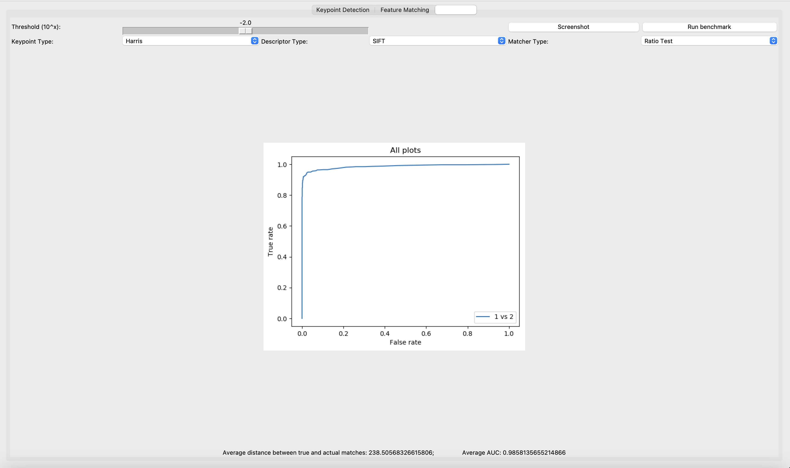

# **Project 2:  Feature Detection and Matching**
  
CS5670 - Intro to Computer Vision  
  
Project Details Page: https://www.cs.cornell.edu/courses/cs5670/2023sp/projects/pa2/
 
 

## Introduction:
The goal of feature detection and matching is to identify a pairing between a point in one image and a corresponding point in another image. These correspondences can then be used to stitch multiple images together into a panorama. In this project, we detected image features and matching pairing features as following:

- Feature detection using Harris
- Feature description (simple and MOPS)
- Feature descriptor SIFT (Scale Invariant Feature Transform) implemented in bonus directory in 'extracredit.py'
- Feature matching (SSD and ratio)

 

## Results:
### Input:
Yosemite 1 & Yosemite 2 
 

  

  

### Output: Keypoint Detection:
Yosemite 1: 1559 keypoints detected
 

  
Yosemite 2: 1356 keypoints detected
  

 

### Output: Feature Matching
MOPS SSD: 1559 Matches
 

 
MOPS Ratio: 1559 Matches 
 

 

Simple SSD: 1559 Matches
 

 
Simple Ratio: 1559 Matches
 

 
  

### Performance Benchmark
ROC Curves and their respective AUC values for all matcher types and tests are shown below in the figure: 
 

 
 

## Extra Credit: SIFT ROC Curves
### ROC Curves:
SIFT SSD Test ROC Curve: AUC Value 0.9841
 

 
SIFT Ratio Test ROC Curve: AUC Value 0.9858
 

  

### Feature Matching Results:

SIFT SSD
 

 
SIFT Ratio
 

